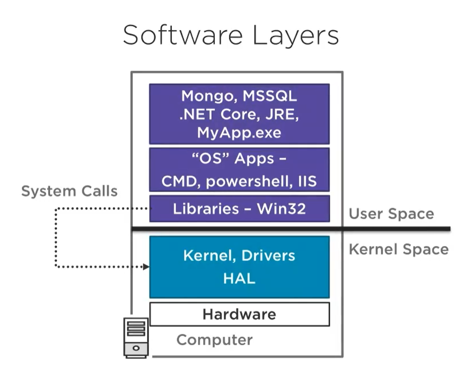
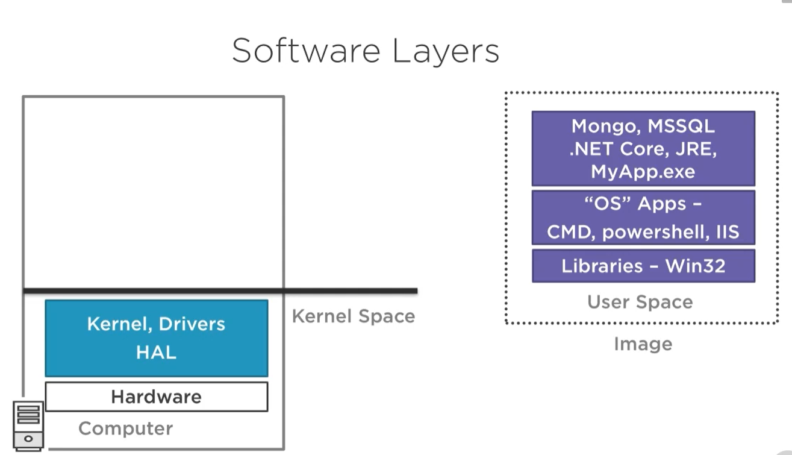
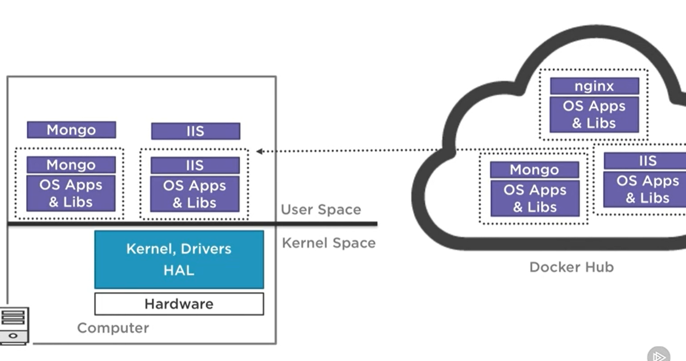
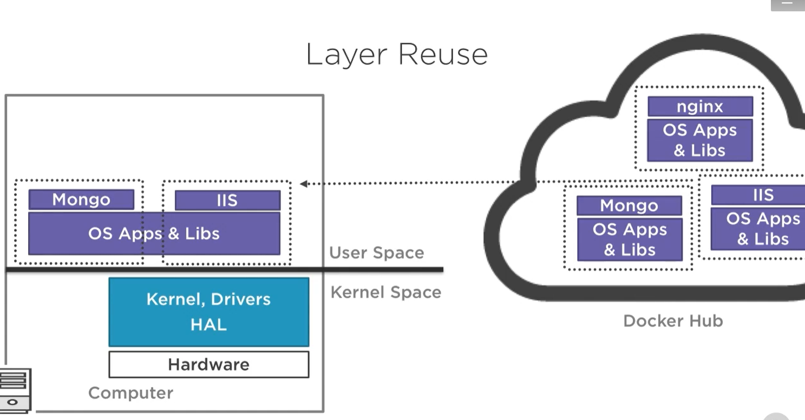
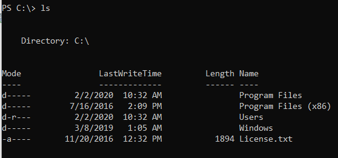
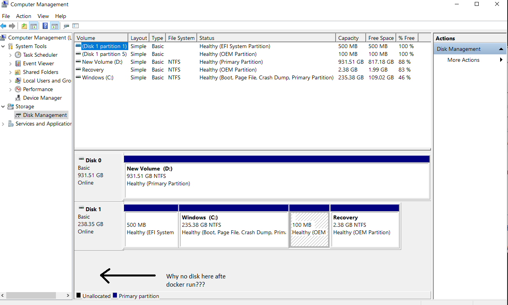
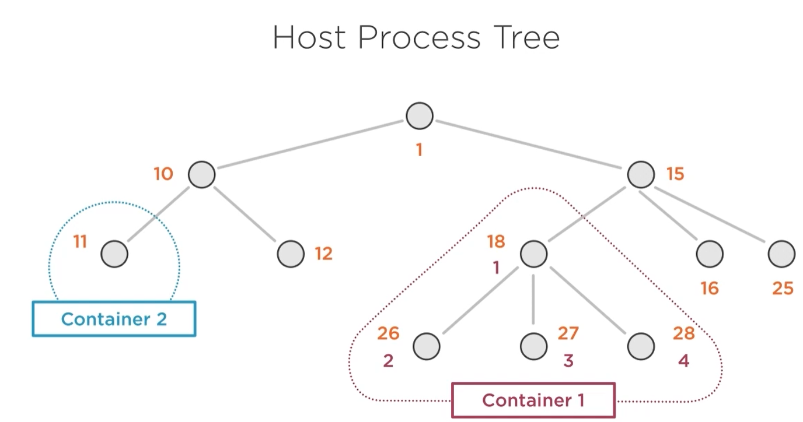

# docker
## commands
| command | comments |
|----------|----------|
| docker |  |
| where docker  |  |
| docker info    |  |
| docker version |  |
| docker ps | shows running processes inside of docker |
| docker run hello-world | if needed downloads the image, next **creates** and runs the container |
| docker run -p 80:80 nginx| [host-port]:[container-port], http://localhost/ |
| docker run -p 80:80 nginx:{tag}| [host-port]:[container-port], http://localhost/, if tag is not specified then latest tag is used |
| ctrl+p+q, ctrl+c |detach from container, kill the container (it does not work always) |
|docker stop 347| stops the container (part of container ID or name has to be provided)|
|docker ps -a|show all processes also these which are stopped|
|docker ps -a --no-trunc|show all processes also these which are stopped without truncating out on the console|
|docker start 347|starts selected container, use parameter *-i* for interactive modex|
|docker images||
|docker rm 347|removes container (not the image)|
|docker rmi nginx fce|removes image(s)|
|docker search docs|search repositories|
|docker run -p 4000:4000 -it --name docs docs/docker.github.io|*it* means **interactive mode**, we will stay in the context of the container, **ctrl+c** will kill the process that is run in the container, **ctrl+p+q** will detach from the container but the process inside container will be still working. NOTE: ctrl+p+q does not work with all containers.<br><br>*name* allows **specify name** for the container|
|docker run -p 81:80 -d --name iis nanoserver/iis|*d* means that we will detach from the run container.<br><br>Because there is an issue with accessing IIS via localhost we have to access directly the process that is run in the container<br><br>**From some reason it did now work on my machine**<br><br>When I used option interactive mode *docker run -p 84:80 **-it** --name iisit nanoserver/iis* then it starts working (localhost:84 displayed IIS web page). When I executed *run* for other ports sometimes I had to use IP from network adapter of the container (I do not know why).|
|docker pull microsoft/windowsservercore|downloads the image|
|docker inspect iis|for example can be used to find IP address of the network adapter used by the container|
|docker run -it microsoft/dotnet:nanoserver dotnet|by passing *dotnet* we can run different app then default (in this case default is cmd.exe)|
|docker run -it microsoft/dotnet:nanoserver powershell|it will switch the context to the container powershell and using Get-Process to list all processes run inside the container|

## software layers

HAL - Hardware abstraction layer



>**All containers share the same kernel. VMs user separated kernels inside each VM. That`s why starting VM takes longer then starting container.**
    
Containers are less isolated then VMs.




>If we are running MongoDB on windows server core containers it shares exactly the same base layer (OS apps and libs) as running IIS on windows server core. There is no reason to duplicate it. If we want reuse this layer we have to make sure that the content is the same. It is preserved because images are read only. *Does it mean that before loading a layer there is some hash computed and checked if it matches to some already loaded layer?* TBD

Nano server image is ~400 MB but windows server core image is ~4GB.

### Files system in containers

Files system is isolated in the containers. It means that if in the container we will execute *ls* command then we will see only files that are in this container.

```
docker run -it microsoft/dotnet:nanoserver powershell
```


Next for example we can create a file:
```
New-Item -Path . -Name "testfile1.txt" -ItemType "file" -Value "This is a text string."
```

Container file system should be visible as separated disk but it did not appear on my machine. If it would appear then it is possible to assign letter to it and use it in host Windows Explorer.

It looks that container runs as long as process inside container runs.   

If we stop and start the container the created file will still be there.



### Processes

Processes are isolated using namespaces. In windows equivalent of namespace is Job object ID (sort by this column in task manager).   
Processes inside of a container cannot see processes which run outside of container but outside processes can see processes that run inside of a container.   
On Linux inside processes get new IDs, on Windows not.




