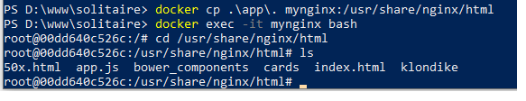
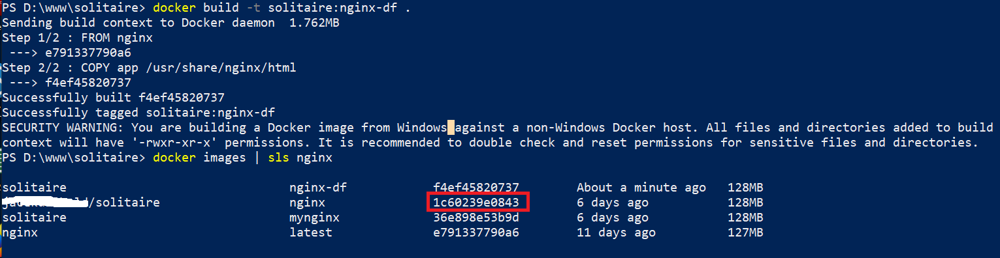
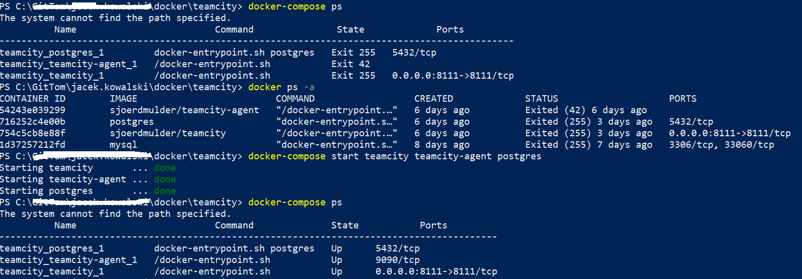
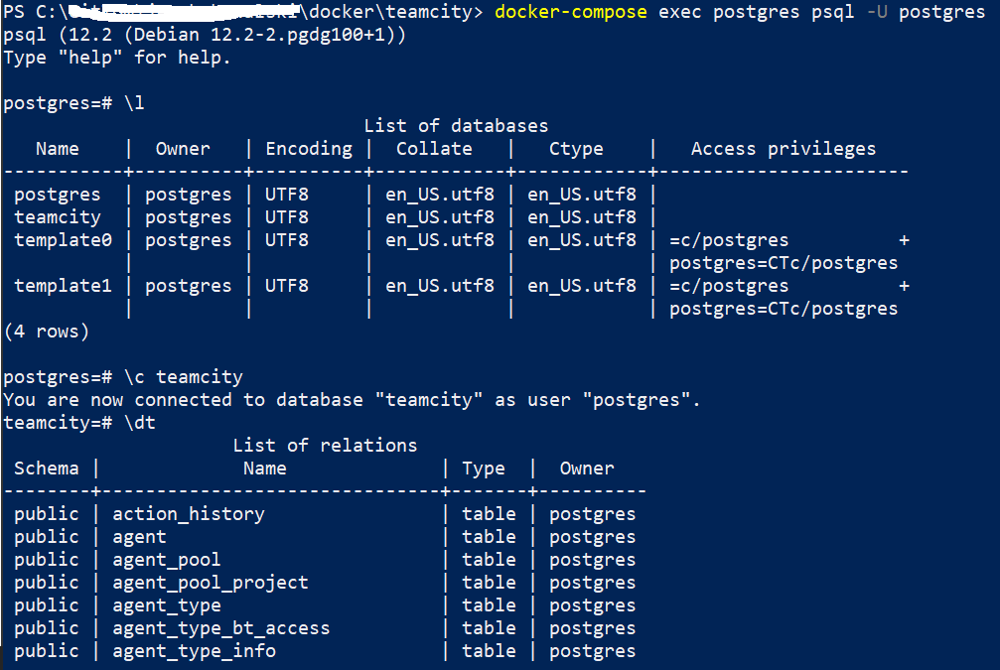

- [commands](#commands)
- [software layers](#software-layers)
  - [Files system in containers](#files-system-in-containers)
  - [Processes](#processes)
  - [Network](#network)
  - [Environment variables](#environment-variables)
  - [Registry (only for Windows)](#registry-only-for-windows)
  - [Users and groups](#users-and-groups)
  - [2 types containers for Windows](#2-types-containers-for-windows)
- [mounting Windows file system in Linux container](#mounting-windows-file-system-in-linux-container)
  - [mount Windows file system in Linux VM](#mount-windows-file-system-in-linux-vm)
  - [mount folder from Linux VM to pointed container](#mount-folder-from-linux-vm-to-pointed-container)
- [building images to host web sites](#building-images-to-host-web-sites)
  - [Volume mount](#volume-mount)
  - [Copy into the Container File System](#copy-into-the-container-file-system)
  - [Bake into an Image](#bake-into-an-image)
    - [Creating a new image](#creating-a-new-image)
    - [Union File System](#union-file-system)
    - [dockerfile](#dockerfile)
- [push images to docker hub](#push-images-to-docker-hub)
- [databases in containers](#databases-in-containers)
  - [sql server container for Windows](#sql-server-container-for-windows)
  - [mysql server container for Linux](#mysql-server-container-for-linux)
  - [docker mamanged volumes (based on mysql example)](#docker-mamanged-volumes-based-on-mysql-example)
    - [create and reuse volume in antoher container](#create-and-reuse-volume-in-antoher-container)
    - [dangling volumes](#dangling-volumes)
- [dangling images](#dangling-images)
- [docker compose](#docker-compose)
  - [starting containers with docker-compose](#starting-containers-with-docker-compose)
  - [logs](#logs)
  - [network](#network-1)
  - [psql for postgres DB](#psql-for-postgres-db)
  - [removing all infrastructure](#removing-all-infrastructure)
- [links](#links)

<small><i><a href='http://ecotrust-canada.github.io/markdown-toc/'>Table of contents generated with markdown-toc</a></i></small>


# commands
| command | comments |
|----------|----------|
| docker |  |
| where docker  |  |
| docker info    |  |
| docker version |  |
| docker ps | shows running processes inside of docker |
| docker run hello-world | if needed downloads the image, next **creates** and runs the container |
| docker run -p 80:80 nginx| [host-port]:[container-port], http://localhost/ |
| docker run --rm -p 80:80 nginx |use rm param to automatically delete container if the main process of the container is stopped|
| docker run -p 80:80 nginx:{tag}| [host-port]:[container-port], http://localhost/, if tag is not specified then latest tag is used |
| ctrl+p+q, ctrl+c |detach from container, kill the container (it does not work always) |
|docker stop 347| stops the container (part of container ID or name has to be provided)|
|docker ps -a|show all processes also these which are stopped|
|docker ps -a --no-trunc|show all processes also these which are stopped without truncating out on the console|
|docker start 347|starts selected container, use parameter *-i* for interactive modex|
|docker images||
|docker rm 347|removes container (not the image)|
|docker rmi nginx fce|removes image(s)|
|docker search docs|search repositories|
|docker run -p 4000:4000 -it --name docs docs/docker.github.io, docker run -it alpine sh|*it* means **interactive mode**, we will stay in the context of the container, **ctrl+c** will kill the process that is run in the container, **ctrl+p+q** will detach from the container but the process inside container will be still working. NOTE: ctrl+p+q does not work with all containers.<br><br>*name* allows **specify name** for the container|
|docker run -p 81:80 -d --name iis nanoserver/iis|*d* means that we will detach from the run container.<br><br>Because there is an issue with accessing IIS via localhost we have to access directly the process that is run in the container<br><br>**From some reason it did now work on my machine**<br><br>When I used option interactive mode *docker run -p 84:80 **-it** --name iisit nanoserver/iis* then it starts working (localhost:84 displayed IIS web page). When I executed *run* for other ports sometimes I had to use IP from network adapter of the container (I do not know why).|
|docker pull microsoft/windowsservercore, docker pull alpine|downloads the image|
|docker inspect iis|for example can be used to find IP address of the network adapter used by the container or OS info (linux or Windows)|.
|docker run -it microsoft/dotnet:nanoserver dotnet|by passing *dotnet* we can run different app then default (in this case default is cmd.exe)|
|docker run -it microsoft/dotnet:nanoserver powershell|it will switch the context to the container powershell and using Get-Process to list all processes run inside the container|
|docker save microsoft/dotnet:nanoserver -o nano.tar|extracts image content to tar file|
|docker run --rm -it alpine| The --rm causes Docker to automatically remove the container when it exits.|
|docker save microsoft/iis:nanoserver -o iis.tar|extracts image to tar file|
|docker stop $(docker ps -q)| stops all running containers|
|docker rm $(docker ps -aq)|removes all containers |
|docker rm -f $(docker ps -aq)|removes all stoped containers |
|docker container prune|removes all stoped containers (available since docker 1.25) |
|docker volume rm $(docker volume ls -q)|removes all not used volumes|
|docker volume prune|removes all not used volumes (available since docker 1.25)|
|docker rm -fv 896|removes containers and its volume - REMOVES ONLY NOT NAMED VOLUMES|
|docker image prune|removes dangline images (images that do not have any tags)|
|docker images -f dangling=true|Lists all dangling images. Command *docker images* does not not show dangling images!.|
|  | filter results|


# software layers

HAL - Hardware abstraction layer


>**All containers share the same kernel. VMs user separated kernels inside each VM. That`s why starting VM takes longer then starting container.**
    
Containers are less isolated then VMs.


>If we are running MongoDB on windows server core containers it shares exactly the same base layer (OS apps and libs) as running IIS on windows server core. There is no reason to duplicate it. If we want reuse this layer we have to make sure that the content is the same. It is preserved because images are read only. *Does it mean that before loading a layer there is some hash computed and checked if it matches to some already loaded layer?* TBD

Nano server image is ~400 MB but windows server core image is ~4GB.

## Files system in containers

Files system is isolated in the containers. It means that if in the container we will execute *ls* command then we will see only files that are in this container.

```
docker run -it microsoft/dotnet:nanoserver powershell
```


Next for example we can create a file:
```
New-Item -Path . -Name "testfile1.txt" -ItemType "file" -Value "This is a text string."
```

Container file system should be visible as separated disk but it did not appear on my machine. If it would appear then it is possible to assign letter to it and use it in host Windows Explorer.

It looks that container runs as long as process inside container runs.   

If we stop and start the container the created file will still be there.


## Processes

Processes are isolated using namespaces. In windows equivalent of namespace is Job object ID (sort by this column in task manager).   
Processes inside of a container cannot see processes which run outside of container but outside parent processes can see processes that run inside of a container.   
On Linux inside processes get new IDs, on Windows not.

NOTE: take a look on [2 types containers for Windows](#2-types-containers-for-Windows) chapter.


## Network
Network inside container is isolated from host machine.

## Environment variables
Environment variables are isolated. Computer name in container is different then computer name of host machine.

## Registry (only for Windows)
Registry is isolated.

## Users and groups
Users and groups are isolated.

## 2 types containers for Windows
| Windows Server Containers | Hyper-V Containers|
|----------|----------|
| Isolation type | Process | VM |
| Windows Server 2016 | Yes | Yes |
| Windows 10 | No | Yes |

When we run windows server containers with process isolation type on host machine are listed process that comes from containers!


It looks that VM isolation type offers stronger isolation but it boots much faster then normal VM.

Used isolation type can be specified via param --isolation for example:

```
docker run -it --isolation=hyperv hello-world
```
# mounting Windows file system in Linux container

In purpose of this example let`s create tar file that later will be accessed from Linux container. ```tar``` command does not exist on Windows so we will mount folder with the tar file on linux container to execute ```tar``` command there.   

This command should be executed when Windows containers are used. After executing this command switch to linux containers.

```
D:\dockershare>docker save microsoft/iis:nanoserver -o iis.tar
```
>NOTE: to run ```docker save``` we have to first download the image using ```docker pull``` command, more [here](https://stackoverflow.com/questions/51309615/docker-save-without-docker-pull).

>NOTE1: sometimes Microsoft exposes the same images in different repositories. For example below we can see the image ```d4d34a16ef9d``` is available for repository ```microsoft/iis``` and ```mcr.microsoft.com/windows/servercore/iis```. It looks that ```microsoft/iis``` is somehow obsolete because in docker hub I was able find only page for the second repo https://hub.docker.com/_/microsoft-windows-servercore-iis.
```ps
PS D:\dockershare> docker images
REPOSITORY                             TAG                 IMAGE ID            CREATED             SIZE
mcr.microsoft.com/windows/nanoserver   1809                9e0259a60cc3        13 days ago         251MB
microsoft/iis                          nanoserver          d4d34a16ef9d        22 months ago       1.29GB
PS D:\dockershare> docker pull mcr.microsoft.com/windows/servercore/iis:nanoserver
nanoserver: Pulling from windows/servercore/iis
Digest: sha256:6064d49ffd47f2c36c3bfbdd74ed87ec6932351de2dd81e90a6f5a7b27343c8f
Status: Downloaded newer image for mcr.microsoft.com/windows/servercore/iis:nanoserver
mcr.microsoft.com/windows/servercore/iis:nanoserver
PS D:\dockershare> docker pull mcr.microsoft.com/windows/servercore/iis:nanoserver
nanoserver: Pulling from windows/servercore/iis
Digest: sha256:6064d49ffd47f2c36c3bfbdd74ed87ec6932351de2dd81e90a6f5a7b27343c8f
Status: Image is up to date for mcr.microsoft.com/windows/servercore/iis:nanoserver
mcr.microsoft.com/windows/servercore/iis:nanoserver
PS D:\dockershare> docker images
REPOSITORY                                 TAG                 IMAGE ID            CREATED             SIZE
mcr.microsoft.com/windows/nanoserver       1809                9e0259a60cc3        13 days ago         251MB
microsoft/iis                              nanoserver          d4d34a16ef9d        22 months ago       1.29GB
mcr.microsoft.com/windows/servercore/iis   nanoserver          d4d34a16ef9d        22 months ago       1.29GB
PS D:\dockershare>
```

## mount Windows file system in Linux VM
First we have to make visible Windows file system in Linux VM that is used as host for Linux containers.
**Switch to Linux containers and select both drives.**


Next we can run the following commands to check that windows file system now is visible on MobyLinuxVM.

```
docker run --privileged -it -v /var/run/docker.sock:/var/run/docker.sock jongallant/ubuntu-docker-client
docker run --net=host --ipc=host --uts=host --pid=host -it --security-opt=seccomp=unconfined --privileged --rm -v /:/host alpine /bin/sh
chroot /host
```

In this way we can see that shared drivers from Windows host now are visible on MobyLinuxVM.

Next for example we can run

```
/ # cat /etc/*-release
PRETTY_NAME="Docker Desktop"
```
to check linux distribution version.   
More here:
https://blog.jongallant.com/2017/11/ssh-into-docker-vm-windows/

## mount folder from Linux VM to pointed container
Finally we can mount selected folder in pointed container. The following command will mount *d:/dockershare* under */data* and next will list content of *data* folder.
   
```
docker run --rm -v d:/dockershare:/data alpine ls /data
```

To extract the file from Linux container to Windows host execute the following command:

```
docker run --rm -it -v d:/dockershare:/data alpine tar -xf /data/iis.tar -C /data/iis
```
> NOTE: before running the above command create on Windows folder *iis* in folder *d:\dockershare*.


After this it is possible to extract also sub-layers.


Next we can see that this layer contains files from *System32* folder:


In case you want mount only the file execute the following commands:

```
docker run --rm -it -v d:/temp/iis.tar:/data/iis.tar alpine sh
/ # tar -tf /data/iis.tar
/ # mkdir /data/extract
/ # tar -xf /data/iis.tar -C /data/extract
/ # cd /data/extract
/ # apk add --no-cache jq
/ # cat manifest.json | jq
```

Another option is to use the following command:
```
PS D:\dockershare> docker run --rm -it -v d:/dockershare:/data alpine /bin/sh -c  "mkdir /data/iis-extract; tar -xf /data/iis.tar -C /data/iis-extract; cd /data/iis-extract; ls -l"
total 6
drwxrwxrwx    1 root     root             0 Sep 16 07:22 158be22956b73b36b28fa03970034128672b610bc9dca903c32848e3234fed11
drwxrwxrwx    1 root     root             0 Sep 16 07:22 6d8fc1d8931382377afab31bc70f27c2d0a8903b528e88ee3570614f0b5f1628
drwxrwxrwx    1 root     root             0 Sep 16 07:23 94494f2dcd1de36c2fb3786547dcab43e2dca9159c73aff7a0e60aafc9347fc9
-rwxr-xr-x    1 root     root          3233 Nov 13  2018 d4d34a16ef9d92b7fba6c81d175ee221b3326420928338523f1f52e2f8925042.json
drwxrwxrwx    1 root     root             0 Sep 16 07:24 ef6e630df0924913141849201d3d12e5a64e53e3e5c5503e366b08ca6c0ef47e
drwxrwxrwx    1 root     root             0 Sep 16 07:24 fddfce52484a6b63ea05b3f86d501a08ad9d91ccec8911fddc908fca7c59c12f
-rwxr-xr-x    1 root     root          1151 Jan  1  1970 manifest.json
-rwxr-xr-x    1 root     root           100 Jan  1  1970 repositories
```
It will:
* mount folder ```dockershare```
* create new folder ```/data/iis-extract```
* extract tar file to folder ```/data/iis-extract``` (more [here](https://www.tecmint.com/extract-tar-files-to-specific-or-different-directory-in-linux/))
* switch to folder ```/data/iis-extract```
* display content of folder ```/data/iis-extract```

# building images to host web sites
There are 3 strategies

## Volume mount
1. Create somewhere on Windows host folder with static files of some web page. For example:


2. Open PS and navigate to *solitaire* folder.

3. Run empty nginx
```
docker run --rm -it -p 8080:80 nginx
```


4. Press ctrl+c to stop the container.


5. Using the following command it is possible to **mount** web site files in nginx server.
```
docker run --rm -it -p 8080:80 -v D:\www\solitaire\app:/usr/share/nginx/html nginx
```
Next we can open *localhost:8080* in web browser to see this web page.

6. Stop this container (ctrl+c).

## Copy into the Container File System

```
docker run -d -p 8080:80 --name mynginx nginx
```
```
docker exec -it mynginx bash
```
Next we can see how looks file system in mynginx container.

After checking this exit from the bash.

```
docker cp .\app\. mynginx:/usr/share/nginx/html
```


Next we can open *localhost:8080* in web browser to see this web page.

## Bake into an Image

### Creating a new image

To create a new image we will use the same image that has been created in chapter **Copy into the Container File System**. We can check that it is still up and running and contains copied earlier files.


Next execute command *docker commit* to create new image with current state of the mynginx image.

```
docker commit mynginx solitaire:mynginx
```


In next step we can create container from the created image.

```
docker run -d -p 8090:80 solitaire:mynginx
```

Next we can open localhost:8090 in web browser to run the web site.

We can run command *docker history* to check which commands have been executed to create the **image**. **We have to provide name of image and not name of container.** This command reflects the same information that can be found also in *dockerfile*.

```
docker history nginx
docker history nginx --no-trunc
docker history solitaire:mynginx
docker history solitaire:mynginx --no-trunc
```


In red we can see additional layer created by *commit* command.

There is also command *docker diff* that can be used to compare **container** **with** its **image**.

```
docker diff mynginx
```

We can see what files have been added to this container.


Dot in docker build command points current folder.


### Union File System
It works like math union operator. It takes different layers and it aggregates them up into single view that container sees.

Each different layer can contribute files and if you want make a change to a file in a layer above then the file in that layer above trump the file in the layer below - top most files win.


### dockerfile


Create docker file and place it in solitaire folder.


Next we can create a new image

```
docker build -t solitaire:nginx-df .
```
(dot points current folder)


In similar way we can create image that uses iis. **Before doing it make sure that docker is set on windows containers mode**.

Dockerfile:
```
FROM microsoft/iis:nanoserver

COPY app c:/inetpub/wwwroot
```
and next run

```
docker build -t solitaire:iis-df .
```


Next run the container and open the app in web browser
```
docker run -d -p 8090:80 solitaire:iis-df
```


Although there is some error in the output the app can be displayed in web browser.

# push images to docker hub

First an image has to be tagged using tag command. There has to be used name of your account in docker hub.


Next login to docker hub:


Next we can push the image


after this we can go to https://hub.docker.com/ and see that image is there.

# databases in containers

## sql server container for Windows

1. download the image

```
docker pull microsoft/mssql-server-windows-express
```


2. create and run container, next check logs
```
docker run -d -p 12345:1433 -e "sa_password=P@ssw0rd1!" -e "ACCEPT_EULA=Y" microsoft/mssql-server-windows-express
docker logs <DOCKER_CONTAINER_ID>
```

NOTE: make sure that used port for mapping is not used by the host!

NOTE1: by default this container is run with isolation **hyperv**. This can be checked by *docker inspect* command.


Next we can connect to this server.


## mysql server container for Linux

1. create and run the container 
```
docker run --name some-mysql -e MYSQL_ROOT_PASSWORD=my-secret-pw -d mysql
```

2. run mysql client in the container to do some operations on DB
```
docker exec -it fa7 mysql -uroot -pmy-secret-pw
```


## docker mamanged volumes (based on mysql example)

To list all volumes execute:
```
docker volume ls
```

Volumes can be sepcified in dockerfile https://github.com/docker-library/mysql/blob/fef511444a9d2867c9e4e20f5b4062bc071c20a2/8.0/Dockerfile#L77

> When a volume is specified for an image it is marking certain path inside of the image to be created as an exteranl volume outside of the file system for the container. The volume is created on the host and mounted into the path from the container.

> VOLUME IS NOT REMOVED WHEN CONTAINER IS REMOVED

### create and reuse volume in antoher container

1. 
```
docker run --name some-mysql-volume -e MYSQL_ROOT_PASSWORD=my-secret-pw -d -v db:/var/lib/mysql mysql
```


2. create database
```
docker exec -it c47 mysql -uroot -pmy-secret-pw
```


3. remove all mysql containers


4. that volumes are still there


5. create new container and reuse existing volume
```
docker run --name some-mysql-reuse-volume -e MYSQL_ROOT_PASSWORD=my-secret-pw -d -v db:/var/lib/mysql mysql
```

We can see that new container uses volume created in the previous container because it already has pets DB.


### dangling volumes

> When a volume exists and is no longer connected to any containers, it's called a dangling volume. 

To identify which volume is used by particular container run *docker inspect* and go to section **Mounts**.


Name contains name of the volume and Source contains path to folder from the container host.

Use the following command to find all dangling volumes.
```
docker volume ls -f dangling=true
```

To remove all dangling volumes execute
```
docker volume rm $(docker volume ls -qf dangling=true)
```

# dangling images

> Dangling images are images that do not have assigned tag (but they still have assigned repo).

1. Let`s assume that we have these images:


2. Next create new image with the same repo and tag that already exists.  **Make sure it will not use any cache because then dangling image would not appear**.

```
docker build -t solitaire:nginx-df .
```

We can see now that 1c6 is used only by one repo.


3. Next assign tag used for 1c6 to newly created image f4e.


**It will cause that image 1c6 will not have assigned any tag and will become dangling image**


# docker compose

Docker compose is used to manage set of containers.

> When you spin up containers via a docker-compose file,  Docker also goes to the trouble of creating an isolated network for you, and these containers are all placed on an isolated network. And there is an embedded DNS server that`s available that will **resolve** the rest of the containers **via their container name**.

Use the following command to execure docker-compose.yml file.
```
docker-compose up
```


Next configure team city server (open in web browser *localhost:8111*).


Database host is just name of the container and database name is defined in yml file *POSTGRES_DB=teamcity*. Default user name is *postgres* and password is not set.


## starting containers with docker-compose

To check status of containers from the particular docker-compose.yml file use the following command:

```
docker-compose ps
```


If some services (containers) are down we can start them by using command

```
docker-compose start [services...]
```

NOTE: names of services must be the same like in yml file and not names of containers.



## logs

```
docker-compose logs [services...]
```


## network

```
docker network ls
docker network inspect [netowrk name..]
```


We can also check if services see each other:


We can also run new container and add it to the existing network

```
docker run --name alpine-net --rm --net teamcity_default -it alpine sh
```


## psql for postgres DB

```
docker-compose exec postgres psql -U postgres
```



## removing all infrastructure

```
docker-compose rm -v -s
```


NOTE: -v is needed to remove also anonymous volumes.

To remove network dedicated command has to be used:

```
docker-compose down
```


# links
https://git.io/vPj49 (from https://app.pluralsight.com/library/courses/docker-windows-getting-started)


