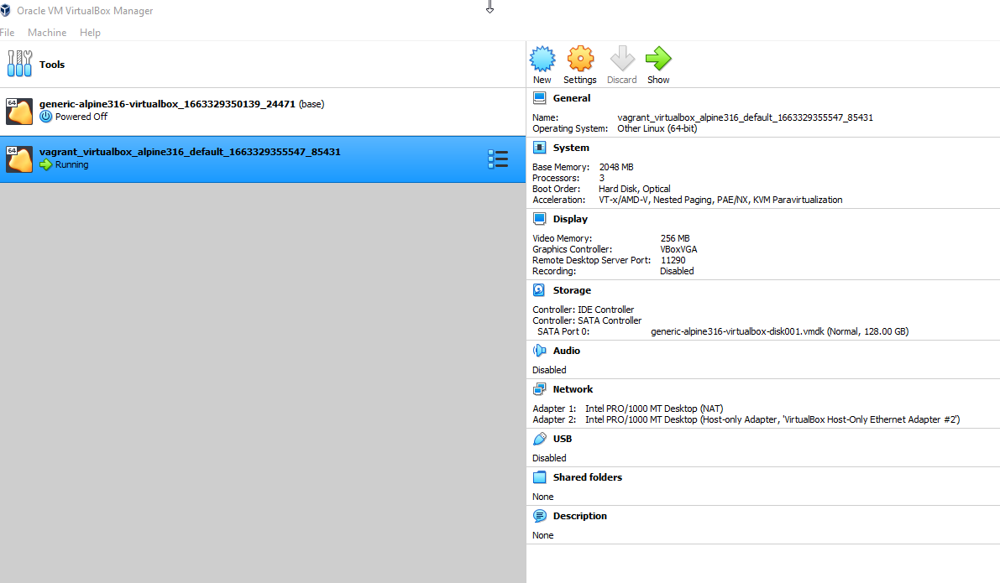

- [Introduction](#introduction)
- [Alpine Linux Vagrant box on Hyper-V](#alpine-linux-vagrant-box-on-hyper-v)
  - [Install Vagrant](#install-vagrant)
  - [vagrant init](#vagrant-init)
  - [vagrant up](#vagrant-up)
  - [vagrant ssh](#vagrant-ssh)
  - [Prepare docker on VM with Alpine Linux](#prepare-docker-on-vm-with-alpine-linux)
  - [Expose docker service for the Win10 host](#expose-docker-service-for-the-win10-host)
- [Alpine Linux Vagrant box on VirtualBox](#alpine-linux-vagrant-box-on-virtualbox)
  - [Install VirtualBox](#install-virtualbox)
  - [Install Vagrant](#install-vagrant-1)
  - [Initialized Alpine box](#initialized-alpine-box)
  - [vagrant up](#vagrant-up-1)
  - [Install docker on the Alpine box](#install-docker-on-the-alpine-box)
  - [Test connection between win containers and vagrant containers](#test-connection-between-win-containers-and-vagrant-containers)
  - [Disable experimental flag in Docker Desktop and test connectivity again](#disable-experimental-flag-in-docker-desktop-and-test-connectivity-again)
- [Links](#links)
- [Commands](#commands)

# Introduction
In this page I try to explain how to run on Win10 win containers and linux container on Alpine VM and support communication from win containers to linux containers.
One scenario is to use Hyper-V and second scenario is to use VirtualBox.
More about vagrant [here](https://www.vagrantup.com/).

**IMPORTANT_NOTE: all the time use the same user from powershell do not switch between admin and normal user during all operations.**
# Alpine Linux Vagrant box on Hyper-V

## Install Vagrant

```ps
choco install vagrant
...
Chocolatey installed 1/1 packages.
 See the log for details (C:\ProgramData\chocolatey\logs\chocolatey.log).

Packages requiring reboot:
 - vagrant (exit code 3010)

The recent package changes indicate a reboot is necessary.
 Please reboot at your earliest convenience.
```

## vagrant init

https://app.vagrantup.com/boxes/search

Before doing this open a new console to have fresh paths.

```
PS D:\Programs\vagrant> vagrant init generic/alpine316
A `Vagrantfile` has been placed in this directory. You are now
ready to `vagrant up` your first virtual environment! Please read
the comments in the Vagrantfile as well as documentation on
`vagrantup.com` for more information on using Vagrant.
```

## vagrant up

https://www.vagrantup.com/docs/providers/hyperv/limitations   
**"Networking configurations in the Vagrantfile are completely ignored with Hyper-V"**

https://docs.microsoft.com/en-us/virtualization/community/team-blog/2017/20170706-vagrant-and-hyper-v-tips-and-tricks

```PS
PS D:\Programs\vagrant> vagrant up
Bringing machine 'default' up with 'hyperv' provider...
==> default: Verifying Hyper-V is enabled...
==> default: Verifying Hyper-V is accessible...
==> default: Box 'generic/alpine316' could not be found. Attempting to find and install...
    default: Box Provider: hyperv
    default: Box Version: >= 0
==> default: Loading metadata for box 'generic/alpine316'
    default: URL: https://vagrantcloud.com/generic/alpine316
==> default: Adding box 'generic/alpine316' (v4.1.10) for provider: hyperv
    default: Downloading: https://vagrantcloud.com/generic/boxes/alpine316/versions/4.1.10/providers/hyperv.box
    default:
    default: Calculating and comparing box checksum...
==> default: Successfully added box 'generic/alpine316' (v4.1.10) for 'hyperv'!
==> default: Importing a Hyper-V instance
    default: Creating and registering the VM...
    default: Successfully imported VM
    default: Please choose a switch to attach to your Hyper-V instance.
    default: If none of these are appropriate, please open the Hyper-V manager
    default: to create a new virtual switch.
    default:
    default: 1) Default Switch
    default: 2) WSL
    default:
    default: What switch would you like to use? 1
    default: Configuring the VM...
    default: Setting VM Enhanced session transport type to disabled/default (VMBus)
==> default: Starting the machine...
==> default: Waiting for the machine to report its IP address...
    default: Timeout: 120 seconds
    default: IP: 172.29.189.220
==> default: Waiting for machine to boot. This may take a few minutes...
    default: SSH address: 172.29.189.220:22
    default: SSH username: vagrant
    default: SSH auth method: private key
    default:
    default: Vagrant insecure key detected. Vagrant will automatically replace
    default: this with a newly generated keypair for better security.
    default:
    default: Inserting generated public key within guest...
    default: Removing insecure key from the guest if it's present...
    default: Key inserted! Disconnecting and reconnecting using new SSH key...
==> default: Machine booted and ready!
```

## vagrant ssh

```
PS D:\Programs\vagrant> vagrant ssh
alpine316:~$
```

## Prepare docker on VM with Alpine Linux

```
alpine316:~$ sudo apk update
fetch https://mirrors.edge.kernel.org/alpine/v3.16/main/x86_64/APKINDEX.tar.gz
fetch https://mirrors.edge.kernel.org/alpine/v3.16/community/x86_64/APKINDEX.tar.gz
v3.16.2-161-gc2ac19fd6b [https://mirrors.edge.kernel.org/alpine/v3.16/main]
v3.16.2-162-ga13aa9359b [https://mirrors.edge.kernel.org/alpine/v3.16/community]
OK: 17031 distinct packages available
```

```
alpine316:~$ sudo apk upgrade
(1/5) Upgrading alpine-baselayout-data (3.2.0-r22 -> 3.2.0-r23)
(2/5) Upgrading alpine-baselayout (3.2.0-r22 -> 3.2.0-r23)
Executing alpine-baselayout-3.2.0-r23.pre-upgrade
Executing alpine-baselayout-3.2.0-r23.post-upgrade
(3/5) Upgrading libcurl (7.83.1-r2 -> 7.83.1-r3)
(4/5) Upgrading curl (7.83.1-r2 -> 7.83.1-r3)
(5/5) Upgrading linux-virt (5.15.62-r1 -> 5.15.67-r0)
Executing busybox-1.35.0-r17.trigger
Executing kmod-29-r2.trigger
Executing mkinitfs-3.6.2-r0.trigger
==> initramfs: creating /boot/initramfs-virt
Executing syslinux-6.04_pre1-r10.trigger
/boot is device /dev/sda1
OK: 125 MiB in 95 packages
```

https://wiki.alpinelinux.org/wiki/Docker#Installation

```
alpine316:~$ sudo apk add docker
(1/15) Installing libseccomp (2.5.2-r1)
(2/15) Installing runc (1.1.4-r1)
(3/15) Installing containerd (1.6.8-r1)
(4/15) Installing containerd-openrc (1.6.8-r1)
(5/15) Installing libmnl (1.0.5-r0)
(6/15) Installing libnftnl (1.2.3-r0)
(7/15) Installing iptables (1.8.8-r1)
(8/15) Installing iptables-openrc (1.8.8-r1)
(9/15) Installing ip6tables (1.8.8-r1)
(10/15) Installing ip6tables-openrc (1.8.8-r1)
(11/15) Installing tini-static (0.19.0-r0)
(12/15) Installing docker-engine (20.10.18-r0)
(13/15) Installing docker-openrc (20.10.18-r0)
(14/15) Installing docker-cli (20.10.18-r0)
(15/15) Installing docker (20.10.18-r0)
Executing docker-20.10.18-r0.pre-install
Executing busybox-1.35.0-r17.trigger
OK: 347 MiB in 110 packages
```

Connecting to the Docker daemon through its socket requires you to add yourself to the `docker` group, in this case it is user `vagrant`.
```
alpine316:~$ sudo addgroup vagrant docker
```

To start the Docker daemon at boot:
```
alpine316:~$ sudo rc-update add docker boot
 * service docker added to runlevel boot
```
and next run:
```
alpine316:~$ sudo service docker start
 * Caching service dependencies ...                                                                   [ ok ]
 * Mounting cgroup filesystem ...                                                                     [ ok ]
 * /var/log/docker.log: creating file
 * /var/log/docker.log: correcting owner
 * Starting Docker Daemon ...                                                                         [ ok ]
```

```
alpine316:~$ sudo reboot -d 0
alpine316:~$ Connection to 172.29.189.220 closed by remote host.
Connection to 172.29.189.220 closed.
```

```
PS D:\Programs\vagrant> vagrant ssh
alpine316:~$ docker version
Client:
 Version:           20.10.18
 API version:       1.41
 Go version:        go1.18.6
 Git commit:        b40c2f6b5deeb11ac6c485c940865ee40664f0f0
 Built:             Sun Sep 11 07:16:22 2022
 OS/Arch:           linux/amd64
 Context:           default
 Experimental:      true

Server:
 Engine:
  Version:          20.10.18
  API version:      1.41 (minimum version 1.12)
  Go version:       go1.18.6
  Git commit:       e42327a6d3c55ceda3bd5475be7aae6036d02db3
  Built:            Sun Sep 11 07:10:00 2022
  OS/Arch:          linux/amd64
  Experimental:     false
 containerd:
  Version:          v1.6.8
  GitCommit:        9cd3357b7fd7218e4aec3eae239db1f68a5a6ec6
 runc:
  Version:          1.1.4
  GitCommit:        5fd4c4d144137e991c4acebb2146ab1483a97925
 docker-init:
  Version:          0.19.0
  GitCommit:
```

```
alpine316:~$ docker run hello-world
Unable to find image 'hello-world:latest' locally
latest: Pulling from library/hello-world
2db29710123e: Pull complete
Digest: sha256:7d246653d0511db2a6b2e0436cfd0e52ac8c066000264b3ce63331ac66dca625
Status: Downloaded newer image for hello-world:latest

Hello from Docker!
This message shows that your installation appears to be working correctly.
```

## Expose docker service for the Win10 host

We have to expose TCP port for the docker daemon:
```
echo '{ "hosts": ["unix:///var/run/docker.sock", "tcp://0.0.0.0:2375"] }' | sudo tee /etc/docker/daemon.json
```

Unfortunately windows containers could not access linux containers (timeout).

# Alpine Linux Vagrant box on VirtualBox

## Install VirtualBox
```
choco install virtualbox --version=6.1.38
```

## Install Vagrant
```
choco install vagrant --version=2.3.0
```
Double check the version: 
```
PS C:\> vagrant --version
Vagrant 2.3.0
```

## Initialized Alpine box

https://app.vagrantup.com/generic/boxes/alpine316

In folder `D:\Programs\vagrant\vagrant_virtualbox_alpine316` run: `vagrant init generic/alpine316`.
It will generate this output: "A `Vagrantfile` has been placed in this directory. You are now
ready to `vagrant up` your first virtual environment! Please read
the comments in the Vagrantfile as well as documentation on
`vagrantup.com` for more information on using Vagrant."

Next modify the `Vagrantfile` to the same value like in TBD

## vagrant up

Next run `vagrant up`. It will generate output like this:
```
Bringing machine 'default' up with 'virtualbox' provider...                                    
==> default: Preparing master VM for linked clones...                                          
    default: This is a one time operation. Once the master VM is prepared,                     
    default: it will be used as a base for linked clones, making the creation                  
    default: of new VMs take milliseconds on a modern system.                                  
==> default: Importing base box 'generic/alpine316'...                                         
==> default: Cloning VM...                                                                     
==> default: Matching MAC address for NAT networking...                                        
==> default: Checking if box 'generic/alpine316' version '4.1.12' is up to date...             
==> default: Setting the name of the VM: vagrant_virtualbox_alpine316_default_1663329355547_854
31                                                                                             
==> default: Clearing any previously set network interfaces...                                 
==> default: Preparing network interfaces based on configuration...                            
    default: Adapter 1: nat                                                                    
    default: Adapter 2: hostonly                                                               
==> default: Forwarding ports...                                                               
    default: 22 (guest) => 2222 (host) (adapter 1)                                             
==> default: Running 'pre-boot' VM customizations...                                           
==> default: Booting VM...                                                                     
==> default: Waiting for machine to boot. This may take a few minutes...                       
    default: SSH address: 127.0.0.1:2222                                                       
    default: SSH username: vagrant                                                             
    default: SSH auth method: private key                                                      
    default:                                                                                   
    default: Vagrant insecure key detected. Vagrant will automatically replace                 
    default: this with a newly generated keypair for better security.                          
    default:                                                                                   
    default: Inserting generated public key within guest...                                    
    default: Removing insecure key from the guest if it's present...                           
    default: Key inserted! Disconnecting and reconnecting using new SSH key...                 
==> default: Machine booted and ready!                                                         
==> default: Checking for guest additions in VM...                                             
==> default: Configuring and enabling network interfaces...                                    
```
In my case it stuck first time on `default: SSH auth method: private key`. I had to stop it by Ctrl+C, next `vagrant destroy` and restart my machine and try again and then it worked. More here: https://terryl.in/en/vagrant-up-hangs/

Next we can see in VirtualBox UI that the VM has been created.



## Install docker on the Alpine box

https://wiki.alpinelinux.org/wiki/Docker#Installation   
https://docs.docker.com/engine/install/linux-postinstall/#configuring-remote-access-with-daemonjson

```
vagrant ssh
sudo apk update
sudo apk upgrade
sudo apk add docker
sudo addgroup vagrant docker
sudo rc-update add docker boot
sudo service docker start // this will also create folder /etc/docker
sudo touch /etc/docker/daemon.json
echo '{ "hosts": ["unix:///var/run/docker.sock", "tcp://0.0.0.0:2375"] }' | sudo tee /etc/docker/daemon.json
sudo reboot -d 0
vagrant ssh
docker version
docker run hello-world
docker -H localhost:2375 ps
logout
docker -H 192.168.33.10:2375 ps // this test if we can connect from docker client windows to the docker engine from the Alpine Vagrant box
```

## Test connection between win containers and vagrant containers

```
vagrant ssh
docker run -p 8989:80 -d nginx
```
On Win10 run:
```
docker run -it mcr.microsoft.com/dotnet/sdk:6.0 // it will automatically enter into cmd
curl http://192.168.33.10:8989 // this will print html generated by the nginx server
```

## Disable experimental flag in Docker Desktop and test connectivity again

When experimental flag was disabled `curl http://192.168.33.10:8989` also worked ok.

# Links

https://stackoverflow.com/questions/26561963/how-to-detect-a-docker-daemon-port
https://docs.docker.com/desktop/faqs/general/#how-do-i-connect-to-the-remote-docker-engine-api
https://docs.docker.com/engine/install/linux-postinstall/#configure-where-the-docker-daemon-listens-for-connections
https://docs.docker.com/engine/reference/commandline/dockerd/
https://stackoverflow.com/questions/54067192/vagrant-config-vm-provision-does-not-allow-me-to-copy-a-file-to-etc-nginx-conf
https://www.altaro.com/hyper-v/complete-guide-hyper-v-networking/
https://www.altaro.com/hyper-v/the-hyper-v-virtual-switch-explained-part-1/
http://woshub.com/hyper-v-enable-routing/

# Commands
```
Get-VMNetworkAdapter -VMName *
```