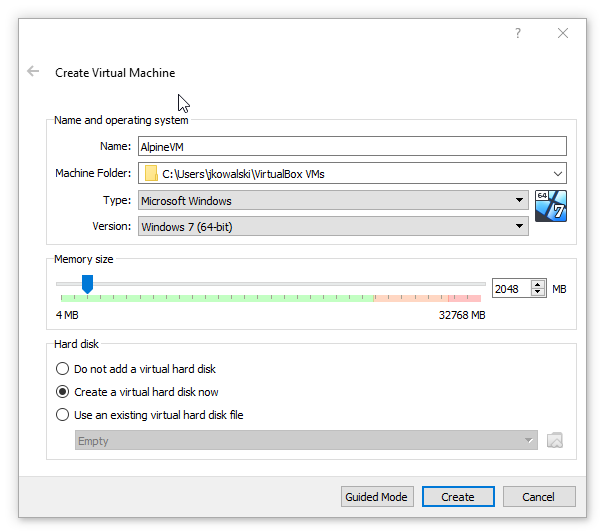
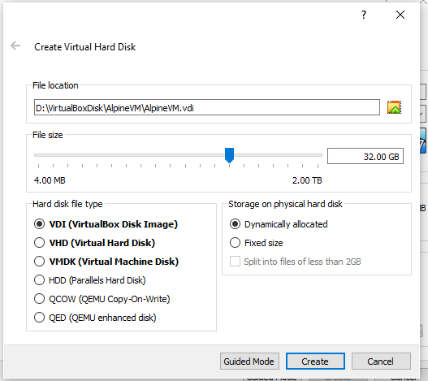
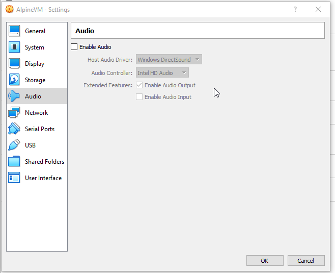
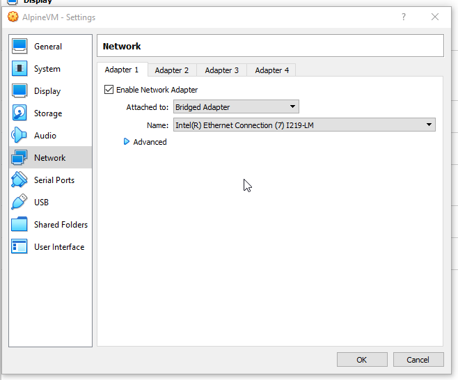
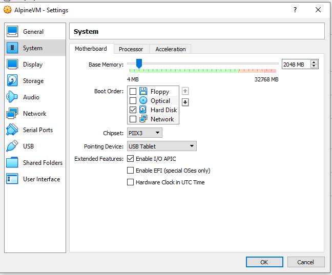

https://www.youtube.com/watch?v=E7zJTzf0pWA

# Creating VM with Alpine





# Setup Alpine

* login as root (there is no pass)
* `setup-alpine` and select `us` and next `us` again
* host name `node1`
* `eth0`
* `dhcp`
* no manual network configuration
* password `root`
* `UTC`
* `none` proxy
* NTP client `chrony`
* `1` as mirror number
* `no` user setup
* `openssh`
* `yes` for root ssh login
* `none` for ssh key URL for root
* disk `sda`
* `sys` for disk usage
* `y` for disk erase
* installation is complete
* `poweroff`

# Additional configuration in VM

* Set bridged adapter to be able access this alpine from the outside of the VirtualBox



* Uncheck floppy and optical because system is already installed



* Run the machine and sign in

* Edit: `vi /etc/ssh/sshd_config` (if `PermitRootLogin` is already set on `yes` then there is no need to change this file if not set it on `yes`).
  After update run `service sshd restart`.

# ssh to the Alpine VM

Before ssh check alpine IP address `ifconfig` and select IPv4 from eth0.

Next use for example `putty` to ssh.

```
login as: root
root@192.168.254.109's password:
Welcome to Alpine!

The Alpine Wiki contains a large amount of how-to guides and general
information about administrating Alpine systems.
See <http://wiki.alpinelinux.org/>.

You can setup the system with the command: setup-alpine

You may change this message by editing /etc/motd.
```

# Install docker on the Alpine VM

https://wiki.alpinelinux.org/wiki/Docker#Installation  

From the ssh session run:

```
apk update
apk upgrade
```

```
vi /etc/apk/repositories
```
and update it like this:
```
#/media/cdrom/apks
http://dl-cdn.alpinelinux.org/alpine/v3.16/main
http://dl-cdn.alpinelinux.org/alpine/v3.16/community
http://dl-cdn.alpinelinux.org/alpine/edge/main
http://dl-cdn.alpinelinux.org/alpine/edge/community
http://dl-cdn.alpinelinux.org/alpine/edge/testing
```
save by `:wq` enter.  

Next:
```
apk add docker
```
```
rc-update add docker boot
```
```
addgroup root docker // not sure it if was really needed here
```

Next restart Alpine VM (it was necessary to have working docker daemon).

# Run Nginx server on docker from Alpine VM

```
docker login // this is necessary to download images...
```

```
docker run -p 8989:80 -d nginx
```

Next open web browser in the host machine and check if it is working (use IP from the eth0 Alpine)
```
http://192.168.254.109:8989/
```
or use curl:
```
curl http://192.168.254.109:8989 -UseBasicParsing
```
or
```
Test-Connection 192.168.254.109

Source        Destination     IPV4Address      IPV6Address                              Bytes    Time(ms)
------        -----------     -----------      -----------                              -----    --------
HYL-774529    192.168.254.109 104.45.152.13                                             32       0
HYL-774529    192.168.254.109 104.45.152.13                                             32       0
HYL-774529    192.168.254.109 104.45.152.13                                             32       0
HYL-774529    192.168.254.109 104.45.152.13                                             32       0
```

# Try to connect to the web server form docker windows


On Windows 10 machine with docker desktop run:

```
docker run -it mcr.microsoft.com/dotnet/sdk:6.0
```
```
curl http://192.168.254.109:8989 // This time param `UseBasicParsing` is not needed
```
and it is working!